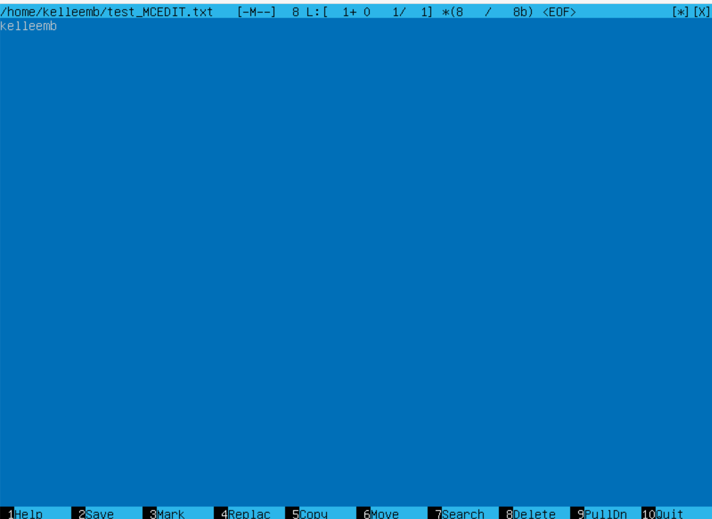
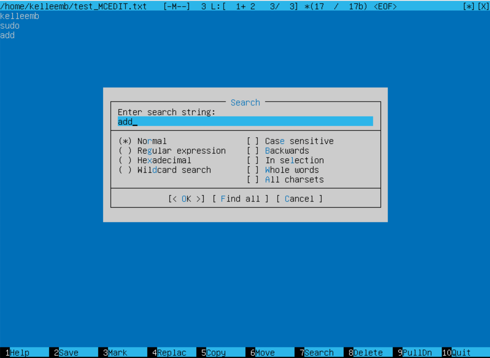
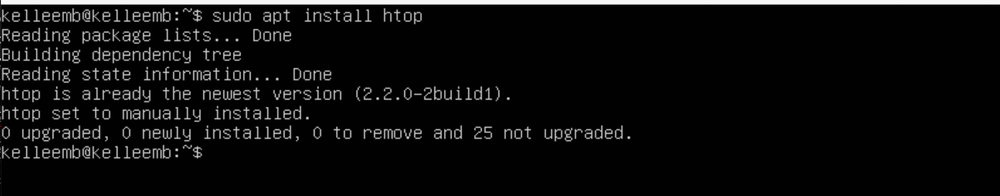
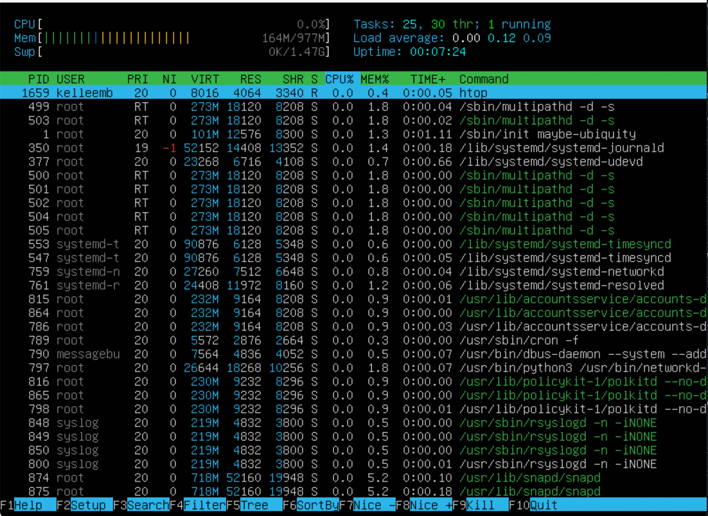
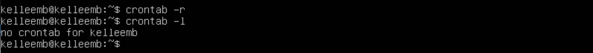

# Часть 1. Установка ОС
* Не должно быть графического интерфейса.
* Проверьте версию Ubuntu, выполнив команду cat /etc/issue
* Добавьте снимок экрана с выводом команды в отчет.

# Часть 2. Создание пользователя
* Добавьте скриншот вызова команды для создания пользователя.

* Новый пользователь должен быть в выводе команды: cat /etc/passwd
* Добавьте скриншот вывода команды.

# Часть 3. Настройка сети ОС
* Установите имя машины как user-1

* Установите часовой пояс, соответствующий вашему текущему местоположению.

* Выведите имена сетевых интерфейсов с помощью консольной команды.

* В отчете дайте пояснение по наличию lo интерфейса. lo- loopback локальная петля, нужна для подключения к сети этого же компьютера, доп настроек не требует
* Используйте консольную команду, чтобы получить IP-адрес устройства, с которым вы работаете, с DHCP-сервера.
* Расшифруйте DHCP в отчете. hostname -I 
    DHCP (Dynamic Host Configuration Protocol )-это протокол прикладного уровня, который помогает назначать IP-адреса устройствам при подключении к серверу.

* Определите и отобразите внешний IP-адрес шлюза (ip) и внутренний IP-адрес шлюза, также известный как IP-адрес по умолчанию (gw).

* внутренний ip адрес Задать статичные настройки ip,gw,dns

* Установите статические (установленные вручную, не полученные от DHCP-сервера) настройки ip, gw, dns (используйте общедоступные DNS-серверы, например, 1.1.1.1 или 8.8.8.8).
* С помощью команды ls /etc/netplan ищем конфиг для настройки открываем его с помощью sudo vim /etc/netplan/filename.yaml

* Перезагрузите виртуальную машину. Убедитесь, что настройки статической сети (ip, gw, dns) соответствуют заданным в предыдущем пункте.

* Успешно пропинговать удаленные хосты 1.1.1.1 и ya.ru и добавить скриншот команды вывода в отчет. В выводе команды должна быть фраза «0% потери пакетов».

# Часть 4. Обновление ОС
* Обновите системные пакеты до последней версии
* После обновления системных пакетов, если вы снова введете команду обновления, должно появиться сообщение о том, что обновлений нет.
* Добавьте скриншот этого сообщения в отчет.

# Часть 5. Использование команды sudo
* Команда sudo ( substitute user and do, подменить пользователя и выполнить ) позволяет строго определенным пользователям выполнять указанные программы с административными привилегиями без ввода пароля суперпользователя root.
* Измените имя хоста ОС с помощью пользователя, созданного в части 2 (используя sudo).
* Добавьте скриншот с измененным именем хоста в отчет.

# Часть 6. Установка и настройка службы времени
* Выведите время часового пояса, в котором вы сейчас находитесь.
* Вывод следующей команды должен содержать NTPSynchronized=yes: timedatectl show
* Добавьте скриншоты правильного времени и вывода команды в отчет.

# Часть 7. Установка и использование текстовых редакторов
* Установите текстовый редактор VIM (+ любые два других, если вам нравятся NANO , MCEDIT , JOE и т. д .)

* Используя каждый из трех выбранных редакторов, создайте файл test_X.txt , где X — имя редактора, в котором создается файл. Напишите в нем свой никнейм, закройте файл и сохраните изменения.
* Добавьте скриншоты в отчет: Из каждого редактора с содержимым файла перед закрытием.

* Используя каждый из трех выбранных редакторов, откройте файл для редактирования, отредактируйте файл, заменив никнейм на строку «21 School 21», закройте файл без сохранения изменений.
* Добавьте скриншоты в отчет: каждого редактора с содержимым файла после редактирования.
* чтоб выйти без сохранения из  vim -:q!  nano - Ctrl+X   mcedit - F10 

* Используя каждый из трех выбранных редакторов, снова отредактируйте файл (аналогично предыдущему пункту), а затем освойте функции поиска по содержимому файла (слова) и замены слова на любое другое.
* Добавьте скриншоты в отчет: Из каждого редактора с результатами поиска слов.

* Из каждого редактора введены команды для замены одного слова другим.

# Часть 8. Установка и базовая настройка службы SSHD
* Установите службу SSHd.

* Добавьте автозапуск службы при каждой загрузке системы.
* Сбросьте службу SSHd на порт 2022.

* Покажите наличие процесса sshd с помощью команды ps. Для этого нужно сопоставить ключи с командой.
* Объясните в отчете значение команды и каждого ключа в ней.
* Перезагрузите систему.
* ps (показывает запущенные процессы, выполняемые пользователем в окне терминала); ps -e или ps -A (Чтобы просмотреть все запущенные процессы); ps -d (Чтобы показать все процессы, кроме лидеров сессии); ps -d -N (можно инвертировать вывод с помощью переключателя -N. Например, если хочу вывести только лидеров сеансов) ps T (увидеть только процессы, связанные с этим терминалом); ps r (просмотреть все работающие (running) процессы); ps -p 'pid' (если вы знаете идентификатор процесса PID, вы можете просто использовать следующую команду, для вывода процесса с этим 'pid'); ps -p 'pid1' 'pid2' ps U 'userlist' (найти все процессы, выполняемые конкретным пользователем); ps -ef (получить полный список);
* -t (--tcp) отображает соедниеня только по tcp
* -a (--all) вывод всех активных подключений TCP
* -n (--numeric) вывод активных подключений TCP с отображением адресов и номеров портов в числовом формате
* Proto: Название протокола (протокол TCP или протокол UDP); recv-Q: очередь получения сети

# Часть 9. Установка и использование утилит top , htop
* Из вывода команды top определить и записать в отчет: время безотказной работы, количество авторизованных пользователей, общая загрузка системы, общее количество процессов, загрузка процессора, загрузка памяти, pid процесса с наибольшим использованием памяти, pid процесса, занимающего больше всего процессорного времени

* uptime 42 min количество авторизованных пользователей 1 общую загрузку системы 0.00 0.00 0.00 общее количество процессов 94 загрузку cpu 0.0 загрузку памяти 164.1 /323.3 pid процесса занимающего больше всего памяти 1 pid процесса, занимающего больше всего процесс времени 1

* Добавьте скриншот вывода команды htop в отчет: отсортировано по PID, PERCENT_CPU, PERCENT_MEM, TIME; отфильтровано для процесса sshd с процессом системного журнала, найденным путем поиска с добавленным выводом имени хоста, часов и времени безотказной работы

* CPU% — использование процессора в процентном отношении.
* MEM% — использование процессом памяти в процентном отношении.
* TIME+ — время работы процесса.
* Command — указывает на команду, которой был запущен процесс.
* Через настройки (F2) можно добавить еще некоторые полезные параметры:
IO RATE — Операции ввода\вывода. Чтение + запись. Если нужно отдельно на чтение и на запись, то можно добавить: IO READ RATE и IO WRITE RATE.

# Часть 10. Использование утилиты fdisk
* Запустите команду fdisk -l.
* В отчет напишите название жесткого диска VBOX HARDDISK, его емкость 10 GiB и количество секторов 20971520, а также размер swap 1.5G.

# Часть 11. Использование утилиты df
* Запустите команду дф.
В отчете напишите для корневого раздела (/): Размер раздела 8408452, используемое пространство 3995108, свободного пространства 3964628, процент использования 51%
* Определите и запишите в отчете единицу измерения 1K.

* Запустите команду df -Th.
* В отчете напишите для корневого раздела (/): Размер раздела 8.1G, используемое пространство 3.9G, свободного пространства 3.8G, процент использования 51%
* Определите и запишите тип файловой системы для раздела в отчете ext4.

# Часть 12. Использование утилиты du
* Запустите команду du.
* Вывести размер папок /home, /var, /var/log (в байтах, в удобочитаемом формате)

* Вывести размер всего содержимого в /var/log 

# Часть 13. Установка и использование утилиты ncdu
* Установите утилиту ncdu.

* Выведите размер папок /home, /var, /var/log.

# Часть 14. Работа с системными журналами
1. cat /var/log/dmesg
2.  cat /var/log/syslog
3. cat /var/log/auth.log
* Запишите время последнего успешного входа в систему 09:35:15, имя пользователя KELLEEMB и метод входа в отчет Cat.

* Перезапустите службу SSHd. sudo systemctl restart ssh
* Добавьте в отчет скриншот сообщения о перезапуске службы (ищите его в логах).

# Часть 15. Использование планировщика заданий CRON
* С помощью планировщика заданий запускайте команду uptime каждые 2 минуты.

* Найдите строки в системных журналах (не менее двух за заданный период времени) о выполнении.

* Показать список текущих заданий для CRON.

* Удалите все задачи из планировщика заданий.

* Добавьте в отчет скриншот списка текущих задач для CRON.